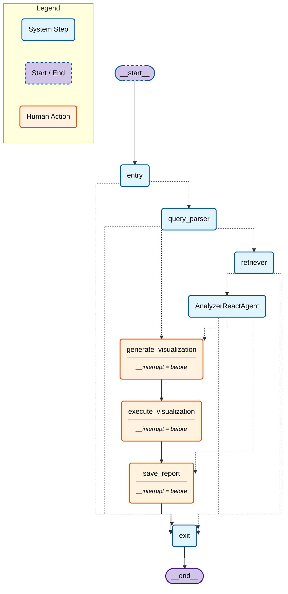

# SportsAgent: Autonomous NFL Stats Visualization with LangGraph

**SportsAgent** is an advanced autonomous agent designed to analyze NFL player statistics, perform comparative evaluations, and generate interactive visualizations on demand.
Built with **LangGraph**, it demonstrates a robust **Human-in-the-Loop (HITL)** architecture where the agent autonomously plans analysis steps but defers to the user for critical decisions like data fetching and visualization generation.

## Technical Overview

## High-Level Overview

The system operates as a cyclic graph that alternates between **Retrieval** (fetching data from `nflreadpy`) and **Analysis** (interpreting data with an LLM). It features:

- **Autonomous Reasoning**: The `AnalyzerAgent` determines if the retrieved data is sufficient or if more is needed.
- **Team & Player Stats**: Supports querying for individual players, entire positions, or specific teams (including "ALL" teams).
- **Interactive Visualization**: Users can request charts, which are generated on-the-fly by the agent writing and executing Plotly code.
- **Stateful Conversations**: Maintains context across multiple turns, allowing for iterative refinement of queries (e.g., "Compare Mahomes and Allen" -> "Now add Burrow").

## Workflow Diagrams

### LangSmith Diagram

### LangChain Mermaid Diagram

## Architecture & Design

The core of SportsAgent is a **LangGraph** workflow that orchestrates the interaction between the user, the LLM, and the data tools.

### LangGraph Workflow

The workflow is defined in `src/sportsagent/workflow.py` and consists of the following key nodes:

1. **Query Parser**: Structured intent extraction to understand which players, positions, and stats are requested.
2. **Retriever**: Fetches raw play-by-play or season-level data using `nflreadpy`.
3. **Analyzer**: A ReAct agent that computes statistics, generates insights, and decides the next step.
4. **Approval Node (HITL)**: A safeguard that pauses execution to ask for user permission before fetching large datasets or performing expensive operations.
5. **Visualization Node (HITL)**: A dedicated step where the agent proposes a visualization, and upon user approval, generates the rendering code.

### Human-in-the-Loop (HITL) Patterns

This project showcases two distinct HITL patterns:

- **Active Approval**: The workflow explicitly pauses at the `approval` interrupt when the agent signals it needs more data. Approval resumes to parsing, then retrieval, so the updated request is treated like any other user query.
- **Opt-In Visualization**: Visualization is conditional and runs only after the user confirms in the UI.
- **Chart-only Follow-ups**: If a follow-up is purely a chart presentation change, parsing can route directly to visualization without calling the retriever.

### State Management

Managing state in a complex agentic workflow is critical. We use a custom Pydantic model `ChatbotState` that tracks:

- **`retrieved_data`**: Stores base datasets (`players`, `teams`) plus optional enrichment datasets (e.g., `rosters`, `snap_counts`) attached under an `extra` mapping.
- **Structured Intent**: Uses Pydantic models (`ChartSpec`, `RetrievalMergeIntent`) to capture precise user requests, ensuring nodes operate on unambiguous structured data rather than free-text.
- **`visualization`**: Stores the generated Plotly figure as a JSON-serialized dictionary, allowing it to be passed between nodes and rendered by the frontend without pickling issues.

## Key Components

### Analyzer Agent

ReAct agent which analyzes the data for statistical relevance, performs comparisons, and decides when to request more data or generate visualizations.

### Visualization Engine

Translates data, preloaded assets, and user intent into high-quality Plotly charts. It receives a schema of the data and the user's query, then writes Python code to generate the figure, which is executed in a sandboxed environment.

### Streamlit UI

The application frontend is built with Streamlit to provide a rich, interactive experience. It features:

- **Workflow Tracing**: A sidebar that visualizes the active path through the LangGraph nodes.
- **Interactive Charts**: Renders the Plotly JSON artifacts directly.
- **Data Inspection**: Allows users to view the raw data tables used by the agent.

<!-- REPORTS-START -->
## Generated Reports

- [20251219-103956: general query](data/outputs/20251219_103956_general_query/report.md)
- [20251218-113410: playerstats-QB ALL rushingyards 2025](data/outputs/20251218_113410_playerstats-QB_ALL_rushingyards_2025/report.md)
- [20251211-181552: RB receivingyards-rushingyards 2023](data/outputs/20251211_181552_RB_receivingyards-rushingyards_2023/report.md)
- [20251210-184118: QB passingyards 2024](data/outputs/20251210_184118_QB_passingyards_2024/report.md)
- [20251209-091723: QB passingyards 2025](data/outputs/20251209_091723_QB_passingyards_2025/report.md)
- [20251209-073659: rushingyards 2024](data/outputs/20251209_073659_rushingyards_2024/report.md)
- [20251209-065240: QB sackyards 2025](data/outputs/20251209_065240_QB_sackyards_2025/report.md)
- [20251208-191436: RBs rushyardsavg 2025](data/outputs/20251208_191436_RBs_rushyardsavg_2025/report.md)
<!-- REPORTS-END -->
