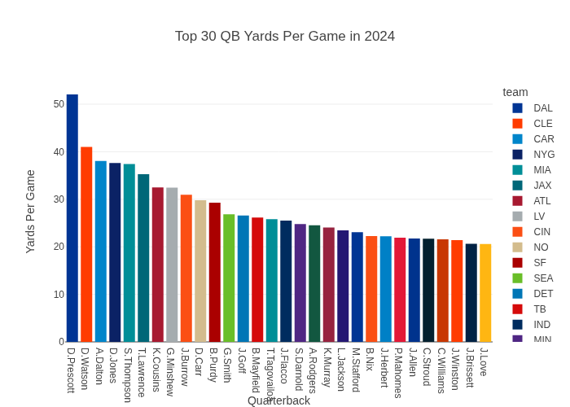

# Report: Show me a chart of top 30 QB yards per game for 2024

**Date:** 2025-12-10 18:41:22

## Query
```text
Show me a chart of top 30 QB yards per game for 2024
```

## Response
To generate a chart for the top 30 quarterbacks (QBs) by passing yards per game for the 2024 season, I'll use the available dataset. This data includes player names, teams, positions, seasons, passing yards, and weeks. I will create a visualization showing the top 30 QBs based on their yards per game. Let's proceed with generating this chart.

## Visualization


## Visualization Code
```python
def generate_plot(df):
    import plotly.express as px

    # Filter the data for quarterbacks (QBs) only from the 2024 season
    qb_data_2024 = df[(df['position'] == 'QB') & (df['season'] == 2024)]

    # Calculate yards per game by dividing passing yards by weeks played
    qb_data_2024['yards_per_game'] = qb_data_2024['passing_yards'] / qb_data_2024['week']

    # Sort the data by yards per game in descending order and select top 30
    top_30_qbs = qb_data_2024.nlargest(30, 'yards_per_game')

    # Generate a bar plot using Plotly Express
    fig = px.bar(
        top_30_qbs,
        x='player_name',
        y='yards_per_game',
        title='Top 30 QB Yards Per Game in 2024',
        labels={'yards_per_game': 'Yards Per Game', 'player_name': 'Quarterback'},
        color='team',
        color_discrete_map=TEAM_COLORS
    )
    
    # Update layout for better appearance
    fig.update_layout(xaxis={'categoryorder': 'total descending'}, xaxis_title='Quarterback', yaxis_title='Yards Per Game')

    return fig
```

## Chat History
### Human
Show me a chart of top 30 QB yards per game for 2024
