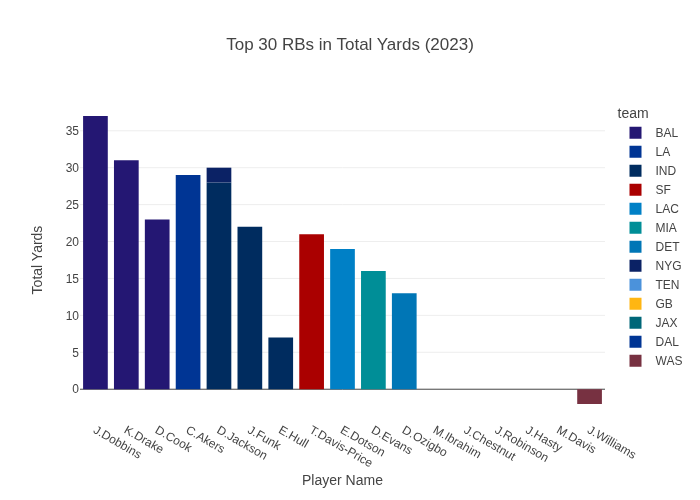

# Report: Show me a chart of the top 30 RBs in total yards (receiving yards + rushing yards) for 2023

**Date:** 2025-12-11 18:15:56

## Query
```text
Show me a chart of the top 30 RBs in total yards (receiving yards + rushing yards) for 2023
```

## Response
To address your query about the top 30 running backs (RBs) in total yards (receiving + rushing yards) for 2023, I will generate a chart. This will help you visualize the performance of these players in terms of their total yardage. I will proceed with the visualization now.

## Visualization


## Visualization Code
```python
def generate_plot(df):
    import plotly.express as px

    # Ensure we're only looking at data for the 2023 season
    df = df[df['season'] == 2023]
    
    # Filter out only Running Backs
    df_rbs = df[df['position'] == 'RB']
    
    # Calculate total yards
    df_rbs['total_yards'] = df_rbs['receiving_yards'] + df_rbs['rushing_yards']
    
    # Group by player name, summing the total yards
    grouped = df_rbs.groupby(['player_name', 'team']).agg({'total_yards': 'sum'}).reset_index()
    
    # Sort by total yards and get the top 30
    top_30_rbs = grouped.sort_values(by='total_yards', ascending=False).head(30)
    
    # Create the Plotly Express bar chart
    fig = px.bar(
        top_30_rbs,
        x='player_name',
        y='total_yards',
        color='team',
        color_discrete_map=TEAM_COLORS,
        title="Top 30 RBs in Total Yards (2023)",
        labels={'total_yards': 'Total Yards', 'player_name': 'Player Name'}
    )
    
    return fig
```

## Chat History
### Human
Show me a chart of the top 30 RBs in total yards (receiving yards + rushing yards) for 2023
