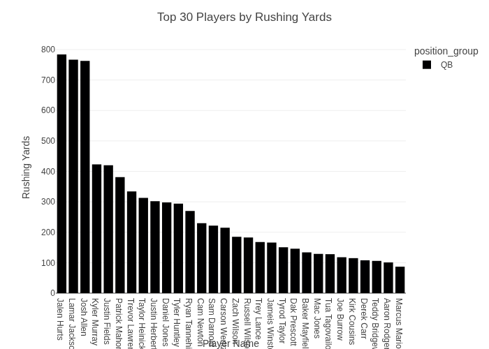

# Report: Only show the top 30 results

**Date:** 2025-12-18 11:34:13

## Query
```text
Only show the top 30 results
```

## Response
The dataset is loaded and includes 81 rows with columns such as player_id, player_name, player_display_name, position, season, penalties, penalty_yards, position_group, season_type, and rushing_yards. Here are a few ideas for visualizations:

1. **Rushing Yards by Position**: Create a bar chart to show the distribution of rushing yards across different positions. This could highlight which positions contribute the most to rushing yards.

2. **Penalties and Penalty Yards**: Generate a scatter plot to analyze the relationship between the number of penalties and total penalty yards per player.

3. **Seasonal Performance Comparison**: A line chart comparing players' performance across different seasons by their rushing yards could provide insights into consistency and improvement over the years.

If you would like to fetch more data for comparison or proceed with a specific analysis/chart, please let me know!

## Visualization


## Visualization Code
```python
def generate_plot(df):
    import plotly.express as px
    
    top_players = df.nlargest(30, 'rushing_yards')
    
    fig = px.bar(top_players, x='player_display_name', y='rushing_yards', 
                 color='position_group', barmode='stack')
    
    fig.update_layout(xaxis_title='Player Name', yaxis_title='Rushing Yards', 
                      title='Top 30 Players by Rushing Yards')
    
    return fig
```

## Chat History
**User:** Show me a chart of the top rushing QBs in 2021

**User:** Only show the top 30 results

**Assistant:** The dataset is loaded and includes 81 rows with columns such as player_id, player_name, player_display_name, position, season, penalties, penalty_yards, position_group, season_type, and rushing_yards. Here are a few ideas for visualizations:

1. **Rushing Yards by Position**: Create a bar chart to show the distribution of rushing yards across different positions. This could highlight which positions contribute the most to rushing yards.

2. **Penalties and Penalty Yards**: Generate a scatter plot to analyze the relationship between the number of penalties and total penalty yards per player.

3. **Seasonal Performance Comparison**: A line chart comparing players' performance across different seasons by their rushing yards could provide insights into consistency and improvement over the years.

If you would like to fetch more data for comparison or proceed with a specific analysis/chart, please let me know!
