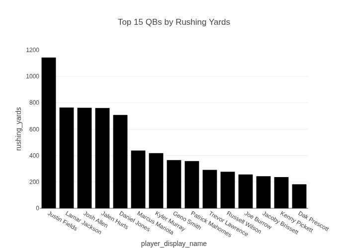

# Report: Limit the chart to only the top 15 QBs

**Date:** 2025-12-19 10:39:59

## Query
```text
Limit the chart to only the top 15 QBs
```

## Response


## Visualization


## Visualization Code
```python
def generate_plot(df):
    import plotly.express as px
    
    # Filter the dataset for only quarterbacks
    qb_df = df[df['position'] == 'QB']
    
    # Aggregate total rushing yards for each QB
    top_qbs = qb_df.groupby('player_display_name', as_index=False)['rushing_yards'].sum()
    
    # Sort QBs by total rushing yards and get the top 15
    top_15_qbs = top_qbs.sort_values(by='rushing_yards', ascending=False).head(15)
    
    # Create bar plot
    fig = px.bar(top_15_qbs, x='player_display_name', y='rushing_yards', title='Top 15 QBs by Rushing Yards')
    return fig
```

## Chat History
**User:** I want to visualize QB rushing yards in 2022

**Assistant:** User approved chart generation.

**Assistant:** User approved chart execution.

**User:** Limit the chart to only the top 15 QBs
