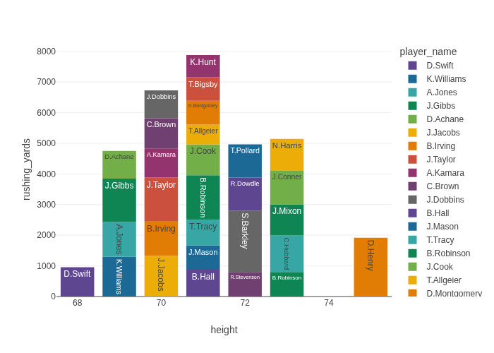

# Report: Show me a chart of the top 30 RBs in rushing yards in 2024 ordered by their height

**Date:** 2025-12-19 16:47:17

## Query
```text
Show me a chart of the top 30 RBs in rushing yards in 2024 ordered by their height
```

## Response
To show you the chart of the top 30 RBs in rushing yards in 2024, ordered by their height, I will first extract the necessary data and then generate the visualization. Let's proceed with the chart generation.

## Visualization


## Visualization Code
```python
def generate_plot(df):
    import plotly.express as px

    # Filter for the 2024 season and regular season
    df_2024 = df[(df['season'] == 2024) & (df['season_type'] == 'REG') & (df['position_x'] == 'RB')]

    # Group by player name and height, then sum up the rushing yards
    df_agg = df_2024.groupby(['player_name', 'height'], as_index=False)['rushing_yards'].sum()

    # Sort by rushing yards descending to get top 30
    top_30_rbs = df_agg.nlargest(30, 'rushing_yards')

    # Sort by height as per request
    top_30_rbs = top_30_rbs.sort_values(by='height')

    fig = px.bar(top_30_rbs, x='height', y='rushing_yards', color='player_name', text='player_name', 
                 color_discrete_sequence=px.colors.qualitative.Prism) 

    return fig
```

## Chat History
**User:** Show me a chart of the top 30 RBs in rushing yards in 2024 ordered by their height

**Assistant:** To show you the chart of the top 30 RBs in rushing yards in 2024, ordered by their height, I will first extract the necessary data and then generate the visualization. Let's proceed with the chart generation.
