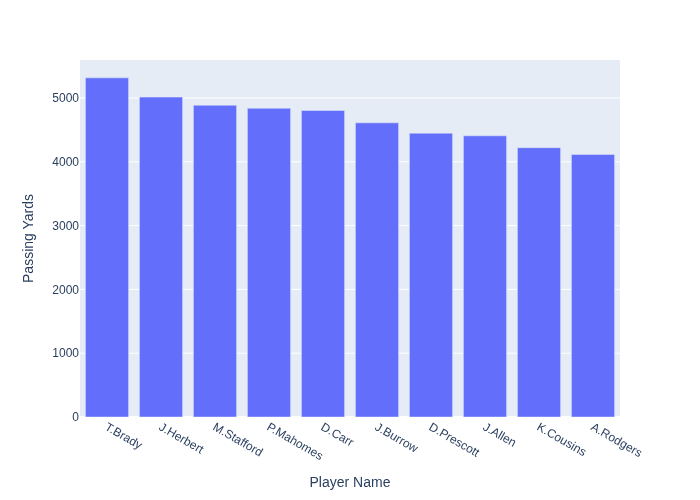

# Report: Show me a chart of the 10 QBs by passing yards 2021

**Date:** 2025-12-22 18:32:35

## Query
```text
Show me a chart of the 10 QBs by passing yards 2021
```

## Response
I will generate a chart for the top 10 quarterbacks by passing yards for the 2021 season based on the provided dataset. Let's proceed with the visualization.

## Visualization


## Visualization Code
```python
def generate_plot(df):
    import plotly.express as px

    # Filter the dataframe for the 2021 regular season quarterbacks
    filtered_df = df[(df['position'] == 'QB') & (df['season'] == 2021) & (df['season_type'] == 'REG')]

    # Group the data by player_name and sum the passing_yards
    aggregated_df = filtered_df.groupby('player_name', as_index=False)['passing_yards'].sum()

    # Sort the data in descending order of passing_yards and pick the top 10
    top_qbs = aggregated_df.sort_values(by='passing_yards', ascending=False).head(10)

    # Sort player names for display order
    ordered_player_names = top_qbs['player_name'].tolist()

    # Create the bar chart
    fig = px.bar(
        top_qbs,
        x='player_name',
        y='passing_yards',
        category_orders={'player_name': ordered_player_names},
        labels={'player_name': 'Player Name', 'passing_yards': 'Passing Yards'}
    )

    return fig
```

## Chat History
**Assistant:** I will generate a chart for the top 10 quarterbacks by passing yards for the 2021 season based on the provided dataset. Let's proceed with the visualization.

## Workflow Trace
- 🤖 Agent: I will generate a chart for the top 10 quarterback...

