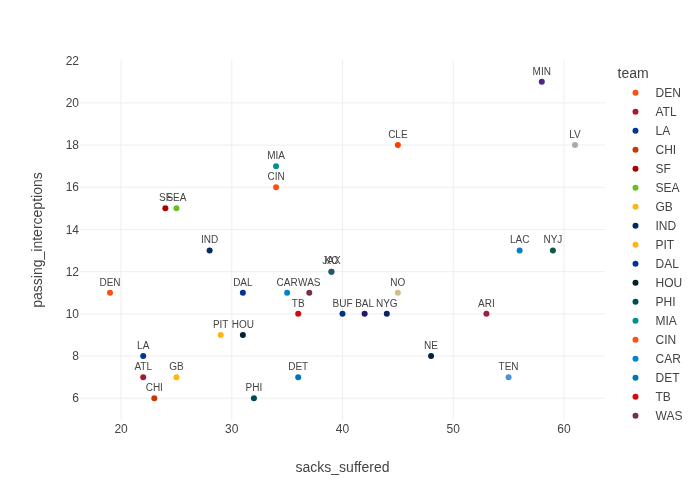

# Report: Create scatter plot for team's sacks suffered vs passing interceptions in 2025

**Date:** 2026-01-02 17:27:21

## Query
```text
Create scatter plot for team's sacks suffered vs passing interceptions in 2025
```

## Response
I will generate a scatter plot to visualize the relationship between "sacks suffered" and "passing interceptions" for teams in the 2025 regular season. This will help us understand if there's any correlation between these two variables.

## Visualization


## Visualization Code
```python
def generate_plot(df):
    import plotly.express as px
    
    df_filtered = df[df['season'] == 2025]
    df_sorted = df_filtered.sort_values(by='sacks_suffered', ascending=True)
    
    fig = px.scatter(df_sorted, x='sacks_suffered', y='passing_interceptions', 
                     text='team', hover_data=['season_type'],
                     color='team', color_discrete_map=TEAM_COLORS)
    fig.update_traces(textposition='top center', textfont_size=10)
    
    return fig
```

## Chat History
**User:** Create scatter plot for team's sacks suffered vs passing interceptions in 2025

**Assistant:** I will generate a scatter plot to visualize the relationship between "sacks suffered" and "passing interceptions" for teams in the 2025 regular season. This will help us understand if there's any correlation between these two variables.

## Workflow Trace
- 🤖 Agent: I will generate a scatter plot to visualize the re...

