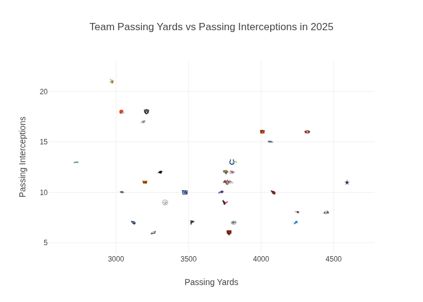

# Report: Show me a chart of team's passing yards vs passing interceptions in 2025

**Date:** 2026-01-04 09:40:17

## Query
```text
Show me a chart of team's passing yards vs passing interceptions in 2025
```

## Response
I will generate a visualization for the 2025 team's passing yards vs passing interceptions. This will help you to see the relationship between the passing yards and the number of interceptions for different teams in that season.

## Visualization


## Visualization Code
```python
def generate_plot(df):
    import plotly.graph_objects as go
    from plotly.graph_objects import Layout

    # Sorting the dataframe by passing_yards first for consistent ordering
    df_sorted = df.sort_values(by='passing_yards', ascending=True)

    # Create a scatter plot with logos using plotly.graph_objects
    fig = go.Figure()

    # Calculate the appropriate logo size
    x_range = df_sorted['passing_yards'].max() - df_sorted['passing_yards'].min()
    y_range = df_sorted['passing_interceptions'].max() - df_sorted['passing_interceptions'].min()
    sizex = x_range * 0.04
    sizey = y_range * 0.04

    for _, row in df_sorted.iterrows():
        team = row['team']
        logo_uri = encode_team_logo(TEAM_LOGO_PATHS[team])
        fig.add_layout_image(dict(
            source=logo_uri, xref='x', yref='y',
            x=row['passing_yards'], y=row['passing_interceptions'],
            sizex=sizex, sizey=sizey, xanchor='center', yanchor='middle', layer='above'
        ))
        # Add invisible point for hover
        fig.add_trace(go.Scatter(
            x=[row['passing_yards']], y=[row['passing_interceptions']],
            mode='markers', marker=dict(size=30, opacity=0),
            hovertemplate=f"<b>{team}</b><br>Passing Yards: {row['passing_yards']}<br>Passing Interceptions: {row['passing_interceptions']}<extra></extra>",
            showlegend=False
        ))

    fig.update_layout(
        title='Team Passing Yards vs Passing Interceptions in 2025',
        xaxis_title='Passing Yards',
        yaxis_title='Passing Interceptions'
    )

    return fig
```

## Chat History
**User:** Show me a chart of team's passing yards vs passing interceptions in 2025

**Assistant:** I will generate a visualization for the 2025 team's passing yards vs passing interceptions. This will help you to see the relationship between the passing yards and the number of interceptions for different teams in that season.

## Workflow Trace
- 🤖 Agent: I will generate a visualization for the 2025 team'...

