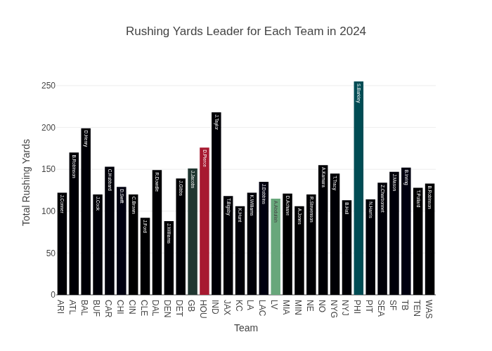

# Report: Show me a chart of the rushing yards leader for each team in 2024

**Date:** 2025-12-09 07:37:03

## Query
```text
Show me a chart of the rushing yards leader for each team in 2024
```

## Response
To identify the rushing yards leader for each team in the 2024 season from our dataset, I will perform the necessary analysis and generate a visualization to highlight these leaders. Let's create a chart to visualize this information.

## Visualization


## Visualization Code
```python
def generate_plot(df):
    import plotly.express as px
    import pandas as pd

    # Define the TEAM_COLORS mapping globally
    TEAM_COLORS = {
        'LV': '#68A77B',
        'GB': '#203731',
        'HOU': '#A71930',
        'PHI': '#004C54',
        # Add additional teams and colors as needed
    }

    # Filter the dataset for the relevant season
    df_2024 = df[df['season'] == 2024]

    # Group by team and player to sum rushing yards, then find the max per team
    rushing_leaders = df_2024.groupby(['team', 'player_name'])['rushing_yards'].sum()
    rushing_leaders = rushing_leaders.reset_index()
    team_leaders = rushing_leaders.loc[rushing_leaders.groupby('team')['rushing_yards'].idxmax()]

    # Create a bar chart using Plotly Express
    fig = px.bar(
        team_leaders,
        x='team',
        y='rushing_yards',
        text='player_name',
        color='team',
        color_discrete_map=TEAM_COLORS,
        title='Rushing Yards Leader for Each Team in 2024'
    )

    # Customize the layout
    fig.update_layout(
        xaxis_title='Team',
        yaxis_title='Total Rushing Yards',
        showlegend=False
    )

    return fig
```

## Chat History
### Human
Show me a chart of the rushing yards leader for each team in 2024
